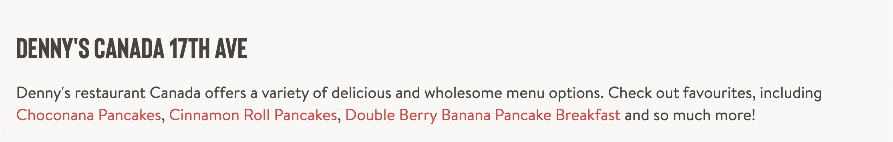
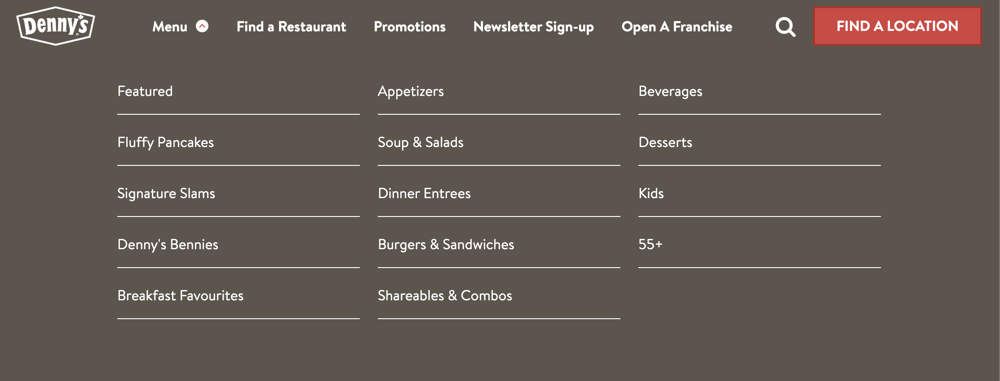
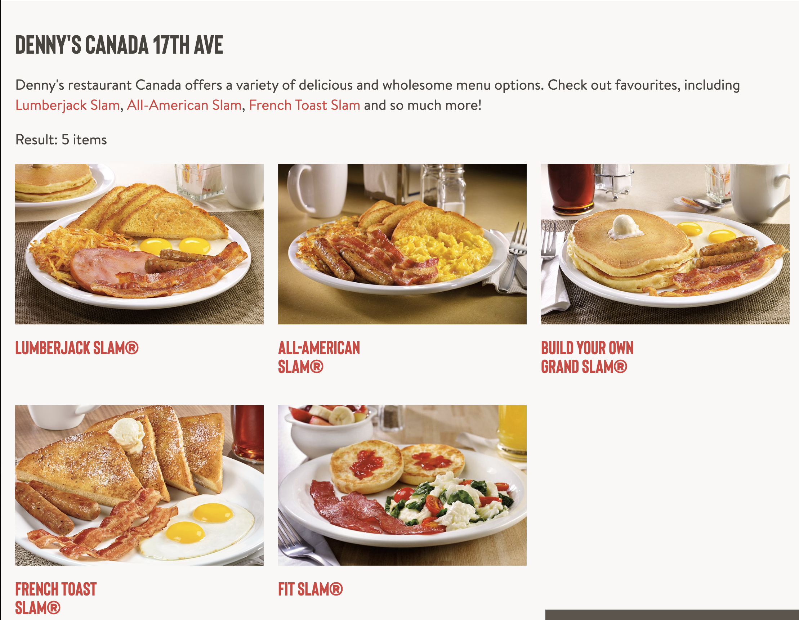
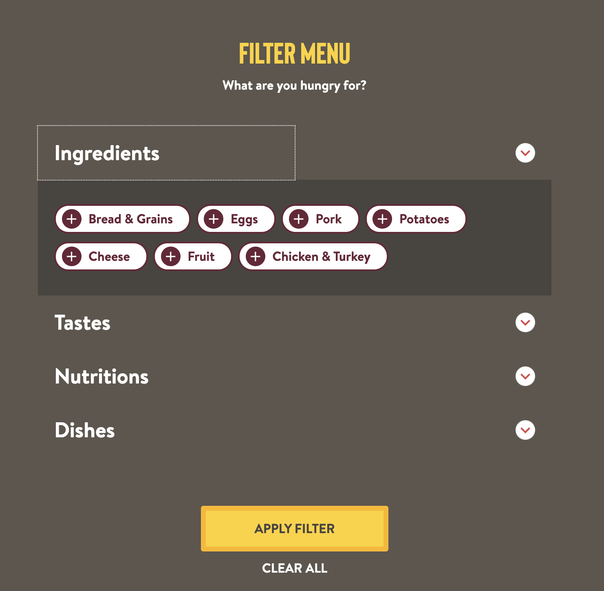
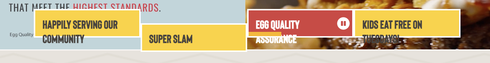
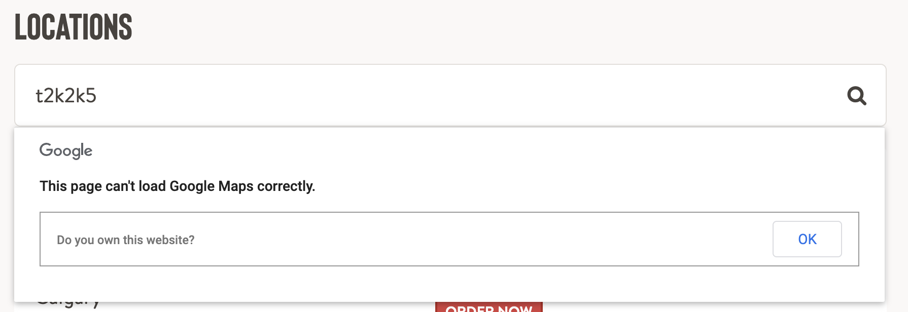
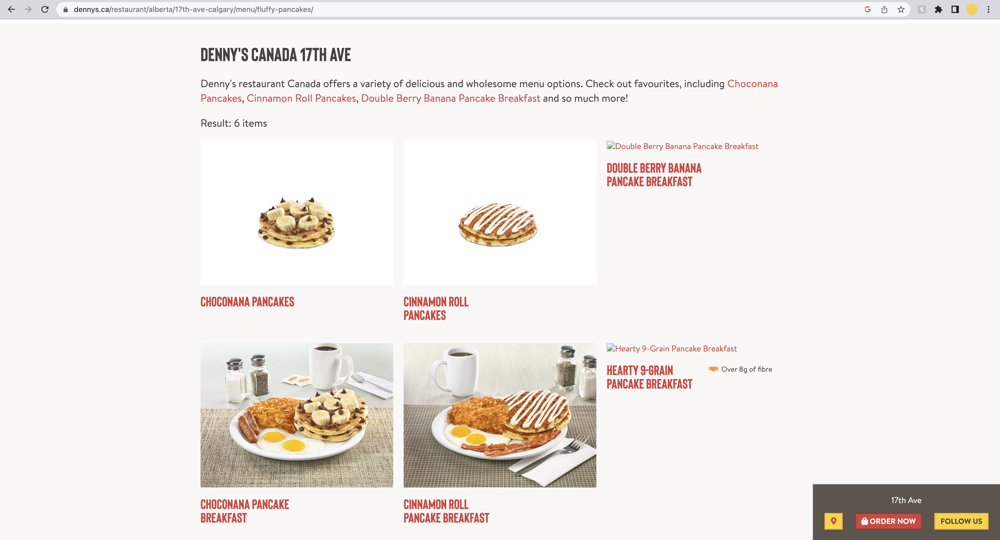

# cpnt200-a1
Assignment 1 - Client site profile 

author: Myka Peligrino

## Client Summary
- Company name: **Denny's**
- Company industry: **Food and Beverage/ Restaurant**
- Website URL: **https://www.dennys.ca/**
- Target audience/customer: **They cater to everyone.**
- What is their value proposition?  
**Denny's values customer satisfaction. They have a wide array of food selections to choose from. This makes their meals customizable, allowing them to cater to customer's requests and preferences. So customers who have dietary preferences and allergen sensitivities can also enjoy.** 
  - What problem do they solve?   
  **They serve quality food for an affordable price. Most of their locations are open 24/7. They can satisfy your food cravings anytime as they have a diverse menu. Their meals are also very much customizable.**
  - What do they sell if anything?    
  **Denny's offer a wide range of dishes from breakfast, lunch, and dinner meals which is available all day. Not just that, but they also offer drinks such as smoothies, milkshaskes, and alcohol. They also have some desserts like cheescakes. A lot of people love that they are still able to eat breakfast meals for dinner, or have a burger first thing in the morning.**

## Sitemap
Figjam link: https://www.figma.com/file/LwJPy9rQq7z1HfYPvdVvQR/cpn201-a1?node-id=1%3A288

## Content type definitions
- 
  - Description: Single type, Text
---
- 
  - Email input area: Single type, Collection type
---
- 
  - Menu dropdown: Enumeration, many-to-many
---
- 
  - Menu: Media, one-to-many
---
- 
  - Content Filter: Single Type, Boolean, many-to-many
---

## Adapt and critique
From a scale of 1-10, I would rate the well structuredness of their website a **7.** I think they have an excellent execution of visual hierarchy and they've also utilized the company colot well. On the first glance, their website appears to be decent looking with the typical site elements such as a nav bar, hero section, cards, and etc. However, there were some flaws that needs to improved such as these elements:
- 
  - When minimized, their comes to a certain point that the texts are outside the container.
- 
  - Their map is not working.
- 
  - Some pictures are not showing.  
I think these flaws are very noticeable and needs to be paid attention to because it hinders the functionality of the website. 

I think one should choose Denny's over it's competitor's because they have a lot to offer. Compared to McDonald's, they have bigger portions and better food quality albeit being a bit pricier. It is worth the money and the people can guarantee that whatever food they want Denny's probably has it on their menu. Also, there are not a lot of places especially here in Calgary where you can sit down and eat steak at 3am. So I think their operating hours is their big market opportunity/advantage.

This website relates to my Strapi project because this industry and this company is something that I am very familiar with. As someone who works at Denny's, I can use my knowledge on the field to translate it on the web. The insights that I have is helpful for me in navigating the site and creating the web flow and contents. 

