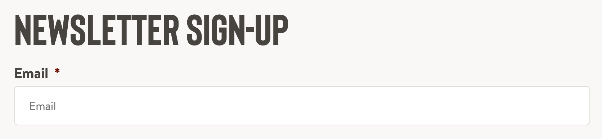

# cpnt200-a1
Assignment 1 - Client site profile 

author: Myka Peligrino

## Client Summary
- Company name: **Denny's**
- Company industry: **Food and Beverage/ Restaurant**
- Website URL: **https://www.dennys.ca/**
- Target audience/customer: **They cater to everyone.**
- What is their value proposition?  
**Denny's values customer satisfaction. They have a wide array of food selections to choose from. This makes their meals customizable, allowing them to cater to customer's requests and preferences. So customers who have dietary preferences and allergen sensitivities can also enjoy.** 
  - What problem do they solve?   
  **They serve quality food for an affordable price. Most of their locations are open 24/7. They can satisfy your food cravings anytime as they have a diverse menu. Their meals are also very much customizable.**
  - What do they sell if anything?    
  **Denny's offer a wide range of dishes from breakfast, lunch, and dinner meals which is available all day. Not just that, but they also offer drinks such as smoothies, milkshaskes, and alcohol. They also have some desserts like cheescakes. A lot of people love that they are still able to eat breakfast meals for dinner, or have a burger first thing in the morning.**

## Sitemap
Figjam link: https://www.figma.com/file/LwJPy9rQq7z1HfYPvdVvQR/cpn201-a1?node-id=1%3A288

## Content type definitions
- 
- 
- 
- 
- 

## Adapt and critique
From a scale of 1-10, I would rate the well structuredness of their website a **7.** On the first glance, their website appears to be decent looking with the typical site elements . There were some flaws that needs to improved such as these elements:
- 
  - When minimized, their comes to a certain point that the texts are outside the container.
- 
  - Their map is not working.
- 
  - The pictures are not showing.  
